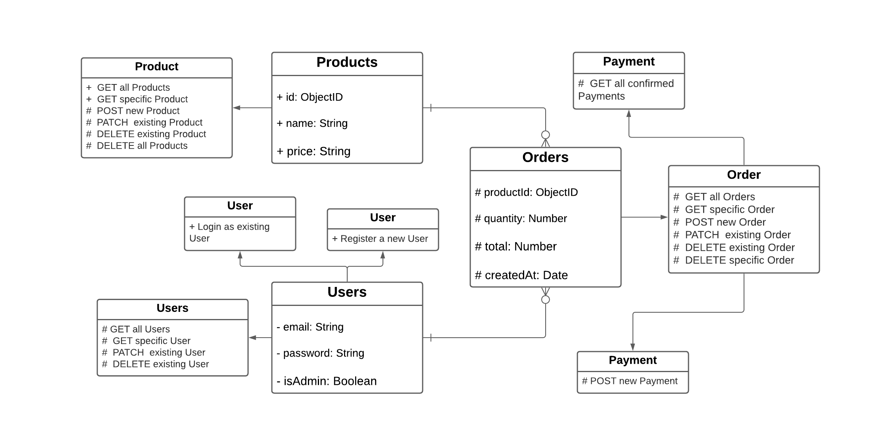

<h2 align="center">RESTful Ecommerce API 🛒</h2>

> Currently under construction. Of course you can explore what I've built so far. Just follow some basic steps mentioned below.

## 🔄 Built with

- NodeJS
- ExpressJS
- MongoDB Atlas
- JavaScript

## 🚩 How to install API

#### Fork and clone this repository using

   ```bash
   git clone https://github.com/sandip2224/EcommerceX-REST-API.git
   ```   
#### Install dependencies and dev dependency using

   ```bash
   npm install
   npm install -D nodemon
   ```  

#### Create a _config.env_ file inside the _/api/config_ directory and add the following key-value pairs

   ```bash
   MONGO_URI=<Your_Unique_MongoDB_Cluster_URL>
   PORT=<Local_Server_Port_Number>
   JWT_KEY=<Your_Private_JWT_Key>
   ```  
   > Note: Get the following URL from MongoDB official website. You need to configure the `username`, `password` and `dbname` accordingly.
   ```bash
   mongodb+srv://<username>:<password>@cluster0.x1ccn.mongodb.net/<dbname>?retryWrites=true&w=majority
   ```

 #### Start the server locally at _localhost:3000_ using

   ```bash
   npm run dev
   ```
   
## 🔱 API Endpoints

### Products

```bash
GET    /api/products
GET    /api/products/:productId
GET    /api/products/reviews
GET    /api/products/reviews/:productId
POST   /api/products/reviews
POST   /api/products
PATCH  /api/products/:productId
DELETE /api/products/:productId
DELETE /api/products
```

### Orders
To manage user order details:

```bash
GET    /api/orders
GET    /api/orders/:orderId
POST   /api/orders
PATCH  /api/orders/:orderId
DELETE /api/orders/:orderId
```

### Users
To manage user credentials and roles:

```bash
GET    /api/users
GET    /api/users/:userId
PATCH  /api/users/:userId
DELETE /api/users/:userId
```

### Payments
To process pending payments on existing orders:

```bash
GET  /api/payments
GET  /api/payments/:paymentId
POST /api/payments/:orderId
```

### Register
To register a new user before login:

```bash
POST /api/users/register
```

### Login
To login a user and generate a JWT token for accessing protected routes:

```bash
POST /api/users/login
```
<!-- ## 🔍 UML Class Diagram

 -->

## 💡 Goals

- [x] Add seller, customer, admin levels for protected endpoints
- [x] Add product image upload functionality with POST route (+testing done)
- [ ] Admin Working Coupon Access (GET+POST+PATCH+DELETE) 
- [x] Payment route should accept home address, pincode, state, country (+testing done)
- [ ] Delivery guy assignment on paid orders with email confirmation
- [ ] Feedback route (on a scale of 1 to 5 stars) + feedbacks can be accessed on a public endpoint [Requires new model]
- [x] Add testing components using Jest and Supertest to replace Postman (On current endpoints)

## 🎴 License

Distributed under the MIT License. See `LICENSE` for more information.

### 👩‍💻 Project Created & Maintained By - [Sandipan Das](https://linkedin.com/in/sandipan0164)
